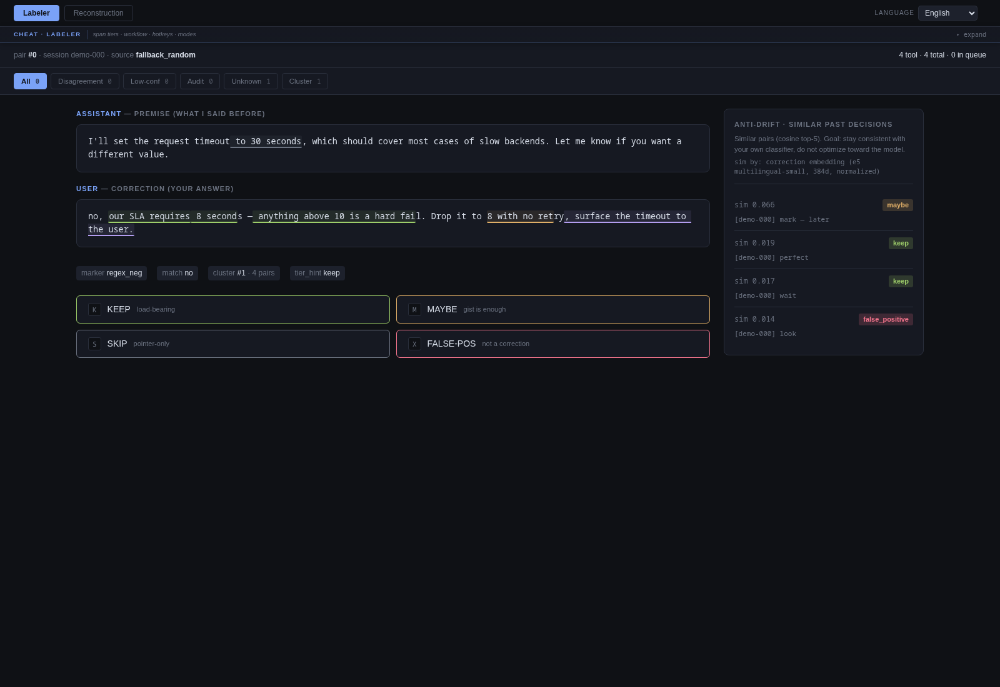

<div align="center">

# weighted-compact

**Trainable context-compaction substrate for Claude Code.**
*Vector-first, classifier-secondary, human-in-the-loop. Replaces `/compact` with reconstruction-from-vectors, not LLM summary.*

[](LICENSE)
[](https://www.python.org/)
[](CHANGELOG.md)
[](#what-this-is)

<sub><i>Local web tool at <code>http://127.0.0.1:18890/</code> — CAPTCHA-style labeler over your own Claude Code sessions, with reconstruction-QA gate.</i></sub>

</div>

---

<p align="center">
  
</p>

<sub><i>The labeler with the cheat-sheet open (top). Span-level annotations on the correction text: <strong style="color:#9ece6a">KEEP</strong> (load-bearing, preserve verbatim), <strong style="color:#e0af68">MAYBE</strong> (keep if budget permits), <strong style="color:#6b7280">SKIP</strong> (drop with confidence), <strong style="color:#b39df0">THINK</strong> (preserve and flag for re-examination). Anti-drift sidebar on the right shows the four cosine-nearest prior labeled pairs with their tier decisions, so future labels stay consistent with past ones. Language selector top-right — UI ships in English, Russian, and Ukrainian.</i></sub>

<p align="center">
  
</p>

<sub><i>Same labeler with the cheat-sheet collapsed for a closer look at the annotated content. All four tier underlines are visible on the correction; the small "K / M / S / X" buttons map to keyboard shortcuts.</i></sub>

<p align="center">
  
</p>

<sub><i>The reconstruction-QA tab with its cheat-sheet open. Build a Q&A set against the source pair, then run eval with three knobs: <code>k_drop</code> (selection threshold), <code>ranker</code> (importance Phase 4C vs density legacy A/B), <code>topic_decay</code> (cross-topic distance penalty).</i></sub>

---

## What this is

A personal compaction tool that learns from **your** Claude Code sessions to
decide what to keep, what to drop, and what to flag for re-examination —
instead of asking an LLM to summarize on the fly.

It is **not** another agent-memory framework. It does not promise zero-config,
it does not run unattended, and it does not optimize for collective use. It is
a workbench for one person at a time, designed around the assumption that
**the person being compacted should participate in designing the mechanism
that compacts them**.

If you want fully automated memory, look at
[TencentDB-Agent-Memory](https://github.com/Tencent/TencentDB-Agent-Memory) or
mem0 / letta / zep. They are good at that job. This tool answers a different
question.

→ [`docs/concept.md`](docs/concept.md) · [`docs/invariants.md`](docs/invariants.md)

## 01 · Vector-first, classifier-secondary

Vectors are the primary representation — e5-multilingual-small embeddings over
your conversation turns, stored as a flat substrate. A classifier sits on top
as a **refinement layer for weighting, not a gatekeeper**. If the classifier
degrades, the pipeline degrades to a vector baseline (top-K by misstep AUC
delta, density, recency) — it doesn't break.

This invariant is locked. Marker-trained classifiers came and went; the
substrate kept working. Future classifiers are swappable without redesigning
the pipeline.

→ [`docs/importance-mixture.md`](docs/importance-mixture.md)

## 02 · CAPTCHA labeling, not bulk annotation

The labeling UI is targeted intervention, not throughput. Two legitimate
triggers fire a labeling request:

- **Gap** — an inline marker in your live session (`(маркер)`, `(подумать)`,
  `(mark)`) auto-queues the surrounding turn for canonicalization.
- **Ambiguity** — classifier disagreement or low confidence surfaces the
  pair for you to resolve.

You sit down and label twenty pairs. You walk away. The tool waits.

The UI shows the **five cosine-nearest prior labels** beside the current pair,
so you can stay consistent with your own past decisions over time. The stability
principle is "you should match your own classifier," not "you should optimize
to the model."

→ [`docs/span-annotation.md`](docs/span-annotation.md)

## 03 · Span-level annotation

Beyond binary keep/drop on whole turns, you can drag-select character ranges
inside a turn and tag them with one of four tiers:

| Tier | Meaning |
|---|---|
| **KEEP** | preserve verbatim — load-bearing detail (a path, a number, a name) |
| **MAYBE** | keep if budget permits |
| **SKIP** | drop with high confidence |
| **THINK** | preserve and flag for re-examination later |

Sub-turn granularity changes what downstream renderers can do: a render layer
can keep only the marked spans verbatim and gist the rest, yielding token
savings of 5–15× on chatty assistant turns.

## 04 · Reconstruction-QA gate

Compression without measurement is wishful thinking. weighted-compact ships
with a reconstruction-QA loop: sample a compacted context, attempt to
reconstruct the meaning, score it against the original. Iter-chain QC drift
labels each step so multi-iteration chains are visible.

This is the part most other tools skip entirely. They assert traceability and
hope.

→ [`docs/reconstruction-qa.md`](docs/reconstruction-qa.md)

## 05 · Topic-aware compaction

An unsupervised topic segmentor runs sliding-window cosine cohesion over
correction embeddings and discovers session boundaries without a classifier.
The compactor then weights each pair by an exponential decay over cross-topic
distance:

    effective_score = importance × decay ^ |Δtopic|

Default `decay=0.5` halves the score per topic-step. `decay=1.0` disables it.
On a multi-topic session, the context compresses ~42% (4597 → 2658 chars) at
`decay=0.3` versus disabled.

## 06 · Local and personal

Nothing leaves your machine. The substrate is built from `~/.claude/projects/`
on the host it runs on. There is no upload, no telemetry, no shared cloud
model. The installer never asks for an API key.

The classifier you train is yours. If you copy it to another machine, it goes
with the labels you produced — and only with those.

---

## Install

```bash
pipx install git+https://github.com/zzallirog/weighted-compact
```

The install puts a `weighted-compact` binary on your `PATH` and pulls in
five hard deps (`fastapi`, `uvicorn`, `pydantic`, `numpy`, `click`). It
does **not** start anything, write anywhere outside the pipx venv, or
register a service.

After install, four things are true:

1. **`weighted-compact compat` runs immediately** as a read-only
   diagnostic — safe to invoke anywhere, never touches state.
2. **No daemon is running.** Nothing listens on port 18890. The labeler
   only comes up when you explicitly run `weighted-compact serve`, or
   enable the systemd user unit (see below).
3. **No substrate exists yet.** `~/.local/share/weighted-compact/` is
   created lazily on first `weighted-compact bootstrap`.
4. **No classifier exists yet.** Once you have labeled twenty pairs,
   `weighted-compact train` fits a baseline. Until then, the importance
   mixture runs on the five non-classifier signals.

A typical first-run sequence is three explicit commands:

```bash
weighted-compact compat       # verify install
weighted-compact bootstrap    # build substrate from ~/.claude/projects/
weighted-compact serve        # launch labeler at http://127.0.0.1:18890/
```

Each command is user-initiated. Nothing in the install path starts a
server, opens a port, or schedules background work.

For **ambient operation** (the labeler auto-starts at user login), opt
into the systemd user unit:

```bash
weighted-compact install-units
systemctl --user daemon-reload
systemctl --user enable --now weighted-compact
xdg-open http://127.0.0.1:18890/
```

This is the only autostart path, and it requires three explicit
commands. `install-units` writes one file under
`~/.config/systemd/user/`; `enable --now` is what actually starts the
labeler. Both are reversible with `systemctl --user disable --now
weighted-compact`.

### Requirements

- Linux. Tested on Arch and Debian-derivatives; CI runs Ubuntu, Arch, Debian.
- Python 3.11–3.13.
- `~/.claude/projects/` — i.e. you have used Claude Code on this host at least
  once. The tool needs sessions to bootstrap from.
- Optional: `sentence-transformers` for re-embedding (the bootstrap reuses
  cached embeddings when present).

### What runs, what doesn't

Right after install:

1. **`weighted-compact compat` works** — read-only diagnostic, prints what was
   detected and what is missing.
2. **No daemon is running.** Nothing listens on `:18890` until you run
   `serve` or enable the systemd unit.
3. **No files have been written under `~/.local/share/weighted-compact/`** —
   the substrate dir is created on first `bootstrap`.

---

## How it works

```
~/.claude/projects/                  → bootstrap reads sessions
   │
   ▼
extract_pairs       → pairs.jsonl    (premise + correction + marker)
feature_extract     → features.npz   (e5 embeddings, 3-vector windows)
density_features    → features_density.npz
misstep_score       → features_misstep.npz   (P(stumble) per pair)
span_features       → features_spans.npz     (annotation char-fraction matrix)
topic_segments      → topic_segments.npz     (per-session topic boundaries)
   │
   ▼
importance.compose  → importance.npz
   = 0.40 × misstep
   + 0.25 × density
   + 0.15 × label
   + 0.20 × span_keep
   + 0.10 × span_maybe
   − 0.15 × span_skip
   + 0.05 × span_think
   │
   ▼
recon_qa.build_compacted_context
   = top-K by importance × decay ^ |Δtopic|
```

The mixture weights are heuristic defaults, surfaced in the UI for tuning.

→ [`docs/architecture.md`](docs/architecture.md)

---

## Status

| Phase | Status |
|---|---|
| Phase 1 — pair extraction + e5 features | ✅ |
| Phase 2 — marker classifier (deprecated, kept for reference) | ✅ failed → reframed |
| Phase 4 — continuous importance mixture (6 signals) | ✅ |
| Phase 4e — span-level annotations + topic decay | ✅ |
| W1 — CAPTCHA labeler UI | ✅ |
| W3 — Reconstruction-QA loop | ✅ MVP (need 50+ baseline) |
| W2 — Ambient background render | ⚪ next |
| Federation patterns (peer-to-peer label exchange) | ⚪ v0.1 direction |

This is `v0.0.01`. Pre-alpha. Expect breaking schema changes until `v0.1.0`.
The architectural invariants are locked; the numbers around them are not.

---

## Where to read further

| File | Topic |
|---|---|
| [`docs/install.md`](docs/install.md) | Platform support, what gets installed, logging, exception matrix |
| [`docs/faq.md`](docs/faq.md) | Common questions, comparisons, troubleshooting |
| [`docs/concept.md`](docs/concept.md) | Why this exists, what it is not |
| [`docs/invariants.md`](docs/invariants.md) | Three locked design invariants |
| [`docs/architecture.md`](docs/architecture.md) | Module map and the substrate pipeline |
| [`docs/importance-mixture.md`](docs/importance-mixture.md) | The six-signal mixture |
| [`docs/span-annotation.md`](docs/span-annotation.md) | Sub-turn char-range tier design |
| [`docs/reconstruction-qa.md`](docs/reconstruction-qa.md) | Compression-fidelity measurement |
| [`docs/topic-decay.md`](docs/topic-decay.md) | Unsupervised topic segmentation + decay |
| [`docs/claude-code-integration.md`](docs/claude-code-integration.md) | How the bootstrap reads `~/.claude/projects/` |
| [`CONTRIBUTING.md`](CONTRIBUTING.md) | What is accepted, what needs discussion |
| [`CHANGELOG.md`](CHANGELOG.md) | Version history |

---

## Help & support

- **Ideas, questions, show-and-tell** —
  [GitHub Discussions](https://github.com/zzallirog/weighted-compact/discussions).
- **Bug you can reproduce** —
  [open an issue](https://github.com/zzallirog/weighted-compact/issues/new).
  Include `weighted-compact compat --json`.
- **PR policy** — see [`CONTRIBUTING.md`](CONTRIBUTING.md). Short version:
  framework PRs welcome, substrate/data PRs no — each install grows its own.

No support SLA. Maintenance is bursty. The repo will go quiet for weeks and
then move in big bumps.

---

## License

MIT — see [LICENSE](LICENSE).
