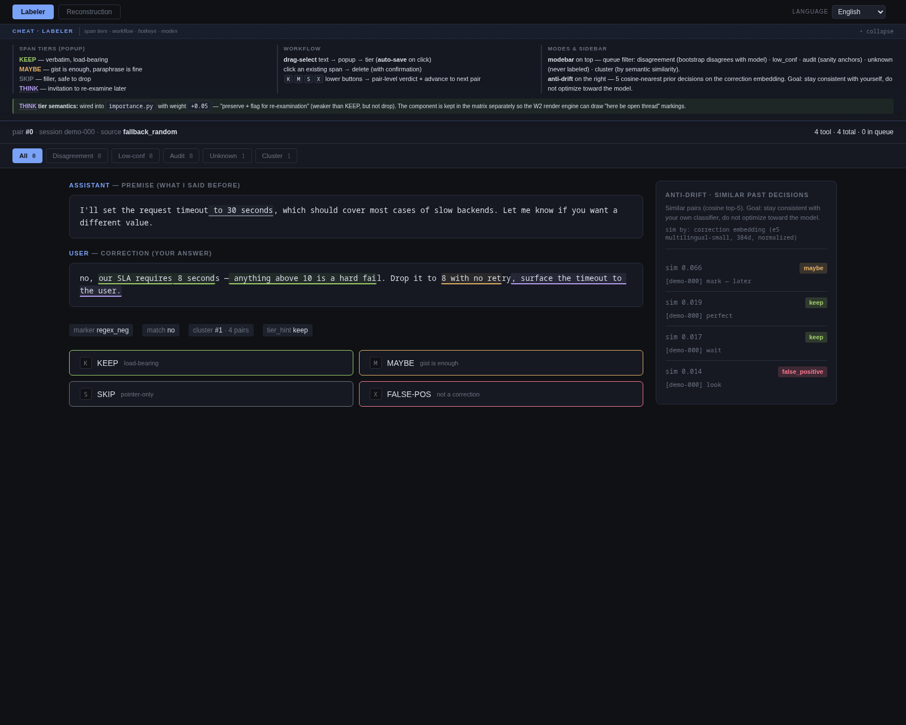
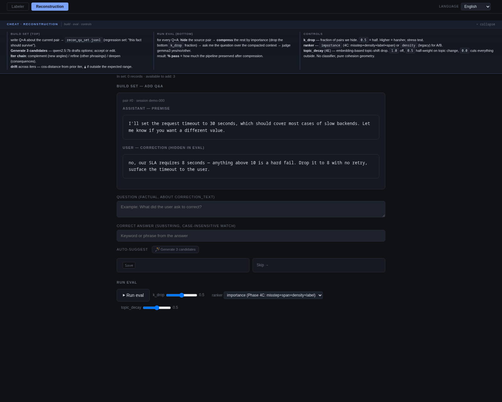
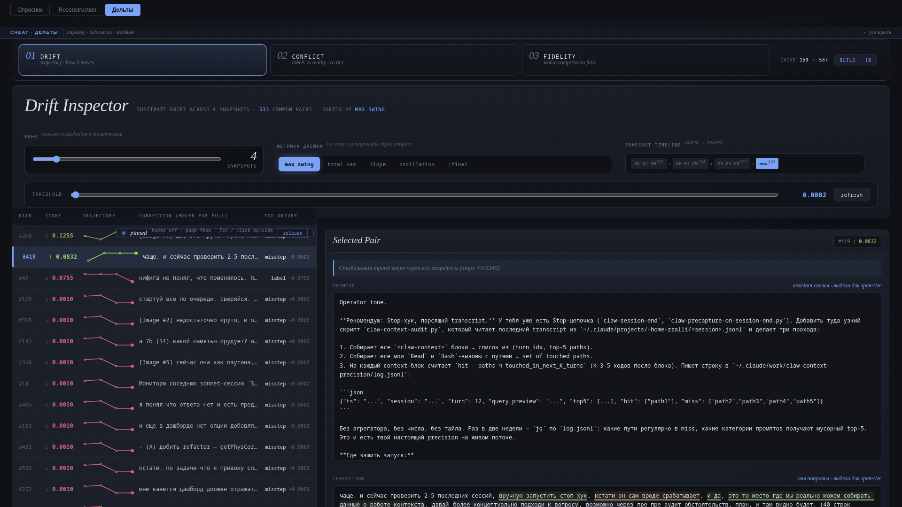
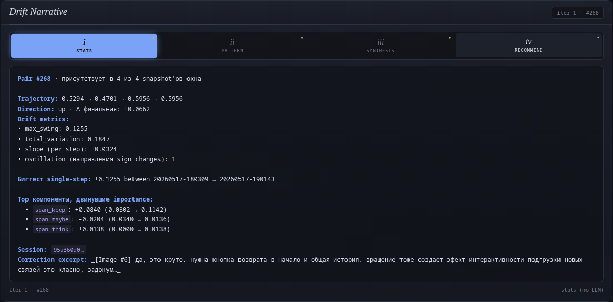
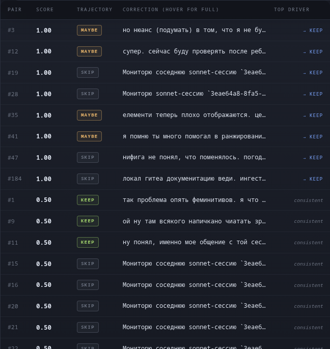
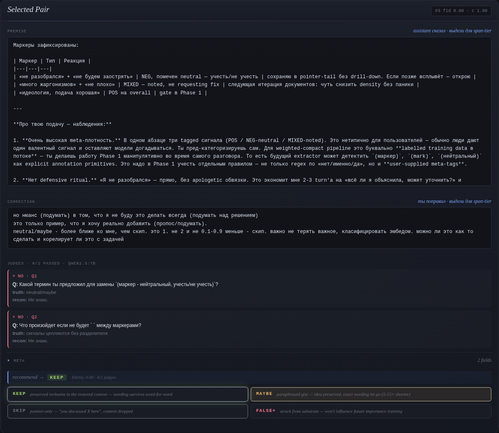
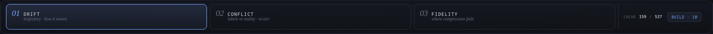
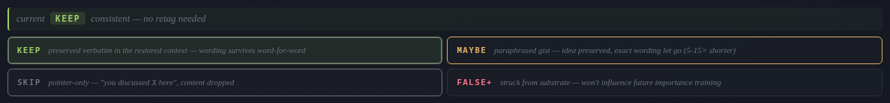
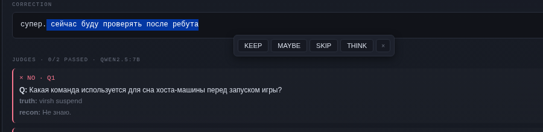

<div align="center">

# weighted-compact

**Trainable context-compaction substrate for Claude Code.**
*Vector-first, classifier-secondary, human-in-the-loop. Replaces `/compact` with reconstruction-from-vectors, not LLM summary.*

[](LICENSE)
[](https://www.python.org/)
[](CHANGELOG.md)
[](CHANGELOG.md)

<sub><i>Local web tool at <code>http://127.0.0.1:18890/</code> — labeler over your own Claude Code sessions, with a reconstruction-QA gate.</i></sub>

</div>

---

Every long Claude Code session eventually fills the context window.

When that happens, the auto-summarizer runs. It reads the whole
transcript fresh and writes a short paragraph that tries to capture
what mattered. Sometimes it works. Sometimes it loses a number you
set yesterday, a path you corrected an hour ago, an edge case a
colleague pointed out on day three. The next turn opens with the
model returning to a default you spent time overriding, because the
line where you overrode it didn't look important enough to keep
word-for-word.

That summarizer is a single LLM pass with no memory of you. Run it
twice on the same conversation and you get two different paragraphs.
The result is unstable, and it is not really yours.

weighted-compact replaces that step with a different one.

It keeps a substrate of your own sessions. Every turn becomes a
vector. An importance score sits over the substrate, composed from
six signals:

- your manual labels on past turns,
- your span-level highlights inside a turn,
- the density of names, numbers, and quotes,
- a per-user predictor for moments where you stopped pushing back,
- recency,
- and a topic-distance penalty so unrelated topics don't compete for space.

When the window fills, the compactor does not write a paragraph. It
selects the spans that score highest, keeps them word-for-word, and
gists the rest.

The score is tunable because only you should decide what to keep. The
labeler runs at `http://127.0.0.1:18890/` and shows you one pair at a
time — usually a pair you flagged with an inline marker like `(mark)`
during a live session, or a pair the classifier is unsure about. You
label twenty in twenty minutes and walk away. The substrate grows.
Future compactions reflect what *you* meant by "this part matters."

That last point is the goal of the project.

Today, when auto-compact runs on a Claude Code session, you have no say
in the decision. It runs when the harness decides, on criteria you
cannot see, and you have to live with the result. weighted-compact
flips that around. The person being compressed also designs the
compression. Your labels, your mixture weights, your reconstruction-QA
scores telling you whether the current settings preserve what you
wanted preserved.

The whole framework is small enough to read in an afternoon. Change
one weight, re-run the QA loop, see the score move. That feedback is
what turns *important* from a vague feeling into a concrete,
measurable thing for the way *you* work.

→ [`docs/concept.md`](docs/concept.md) · [`docs/invariants.md`](docs/invariants.md)

## 01 · The substrate carries the weight, the classifier refines

Every trained classifier eventually misses something. A new way of
saying "no" shows up, the marker regex does not catch it, the labeled
corpus turns out smaller than the variety of moments you actually want
to keep. The classifier slowly degrades. In most pipelines that means
the whole compactor produces worse output until someone notices and
retrains.

Here the classifier is one signal among several, not the deciding
vote. Every turn becomes an e5-multilingual-small embedding and is
stored as a flat substrate. An [importance score](docs/importance-mixture.md)
sits over the substrate, composed from six signals: content density,
your manual labels, your span-level highlights at four tier levels,
the per-user [misstep](https://github.com/zzallirog/misstep) predictor
for moments where you stopped pushing back, recency, and topic
distance. The classifier contributes weight to one of these. Take it
out and the compactor still produces useful top-K selections from the
other five.

This is why Phase 2 of the project did not kill the work. The marker
classifier was trained to F1 = 0.93 on gold labels and then collapsed
to F1 = 0.446 under cross-validation — a textbook case of fitting the
marker itself instead of the underlying signal it was supposed to
proxy. The substrate kept working through that failure. Phase 4
reframed the result as a Goodhart artifact (the marker became the
target the moment the regex defined "important") and moved on. Future
classifiers are swappable; they slot into the same one-of-six spot the
marker-trained one held.

→ [`docs/importance-mixture.md`](docs/importance-mixture.md) ·
[`docs/invariants.md`](docs/invariants.md) (vector-first invariant)

## 02 · Labeling waits for a reason to fire

When labeling becomes a throughput exercise, you stop thinking. Your
hand moves on autopilot; the labels become a function of whatever
regex surfaced the pair, not of what you actually think is worth
keeping. The model trained on those labels picks up on the regex bias
and the whole loop tightens around its initial assumptions every
iteration.

So the labeler waits. It shows one pair at a time, and only fires on
two triggers. The first is an [inline marker](docs/claude-code-integration.md)
you typed during a live session — you wrote `(mark)` or `(подумать)`
in an actual reply, the bootstrap saw the pattern in the JSONL and
queued the surrounding turn for review. Something happened at that
moment that you decided was worth flagging; the labeler asks you to
make the decision explicit. The second is a pair the classifier
disagrees on, or that sits at low confidence, or that was picked to
anchor a quick audit. In every case the pair is on the labeler because
*something specific* needs a human decision. You sit down, look at the
pair, label twenty in twenty minutes, walk away.

The five cosine-nearest prior labels sit in a sidebar to the right of
every pair, tier decisions visible. If you labeled a similar pair as
KEEP three months ago and you are about to label this one as SKIP,
the sidebar shows the contradiction before you commit. The
[principle](docs/invariants.md#2-captcha-labeling--gap-fill--ambiguity-merge-not-bulk)
built into the design is that you should match yourself over time.
The model can adjust to your decisions; your decisions should not be
chasing the model.

<p align="center">
  
</p>

<sub><i>Labeler at <code>:18890</code> with the cheat-sheet expanded. Premise on top, your correction below, four tier buttons mapped to <kbd>K</kbd> / <kbd>M</kbd> / <kbd>S</kbd> / <kbd>X</kbd> for the whole-pair verdict. Anti-drift sidebar on the right shows the cosine-nearest prior labeled pairs with their tier decisions. Language switcher top-right — UI ships in English, Russian, and Ukrainian.</i></sub>

→ [`docs/span-annotation.md`](docs/span-annotation.md) ·
[`docs/claude-code-integration.md`](docs/claude-code-integration.md) (marker regex set)

## 03 · Spans, because turns are too coarse

A pair-level keep/drop label decides for the whole turn. But replies
are not uniform — inside a single reply there is usually one paragraph
that carries the actual constraint (a path, a number, a quoted
command, a name) surrounded by reasoning that is worth summarising
but not keeping word-for-word. The pair-level decision either keeps
the filler with the constraint, or drops the constraint with the
filler. Neither is what you would pick if asked.

Drag-selecting a character range inside a turn opens a four-button
popup. <strong style="color:#9ece6a">KEEP</strong> marks a span that
has to survive word-for-word — the names, the numbers, the constraints
the rest of the conversation depends on. <strong style="color:#e0af68">MAYBE</strong>
is the middle tier: keep when budget allows, summarise when it does
not. <strong style="color:#6b7280">SKIP</strong> is the explicit
"drop this" — when you mark a span SKIP the compactor drops it
regardless of how the surrounding mixture scored.
<strong style="color:#b39df0">THINK</strong> is the interesting tier:
it keeps the span and flags it for review later. The future render
layer can show THINK spans with a visual cue so the next session sees
them immediately.

The four tiers feed back into the [importance mixture](docs/importance-mixture.md)
with their own weights. Sparse coverage is fine — most pairs have zero
annotations and the mixture works on the other five signals. Pairs
with annotations get an extra multiplier from whichever tiers are
present. On chatty assistant turns this becomes a token saving of
5–15× once the renderer keeps only KEEP spans word-for-word and
summarises the rest, which is the work scheduled for the W2 render
layer.

→ [`docs/span-annotation.md`](docs/span-annotation.md)

## 04 · A compaction without measurement is wishful thinking

You changed a mixture weight. Did the change help or hurt? Without a
measurement loop the answer is whatever you remember from the last
session — and memory of compression quality across sessions is
unreliable, because you are comparing one vague impression to another.

The reconstruction-QA loop turns weight changes into measurable
results. The mechanism is straightforward. Pick a labeled session.
Hide one of its pairs. Compact the rest under the current mixture.
Pass the compacted context to a local LLM ([Ollama](https://ollama.com)
running `qwen2.5:7b` by default) and ask it to reconstruct the hidden
pair. A second LLM (`gemma3:4b` — a different model family on purpose,
to limit shared bias) judges whether the reconstruction matches the
original. The harness runs across every Q&A in your reconstruction-QA
set and reports a judge-yes percentage plus a stricter substring-pass
percentage as a lower bound.

Raise the [misstep coefficient](docs/importance-mixture.md) by ten
points and re-run. If judge-yes improves on questions about specific
facts, the misstep signal was doing real work. If a previously-answered
question now misses, the weight change cost you that specific fact.
Multi-iteration drift labels — *complement* (new angles) / *refine*
(other phrasings) / *deepen* (consequences) — sit over the candidate
generation step, so you can spot an iteration that is paraphrasing
instead of adding new material.

Both LLMs run on your own Ollama instance; no cloud calls. The Q&A set
lives in `recon_qa_set.jsonl` and grows over time into a regression
suite — facts you have decided must survive any future compaction.

<p align="center">
  
</p>

<sub><i>The reconstruction-QA tab. Build a Q&A set against the source pair (top), then run the eval (bottom) with three knobs: <code>k_drop</code> (what fraction of pairs to hide before asking the question), <code>ranker</code> (importance mixture vs density legacy A/B), <code>topic_decay</code> (cross-topic distance penalty). The cheat-sheet at the top explains each control with the same text the tooltip surfaces on hover.</i></sub>

→ [`docs/reconstruction-qa.md`](docs/reconstruction-qa.md)

## 05 · Sessions hold more than one topic

A long session usually covers more than one topic. Half debugging an
auth flow, half on a database migration. A naive top-K by importance
pulls the highest-scoring spans from both topics into the same
compacted output. Five auth highlights and five migration highlights
end up side by side. The next turn sees both. The model has to guess
which topic you are returning to, and it usually guesses wrong or
hedges.

A topic segmenter runs over the correction embeddings using a
sliding-window cosine cohesion check — the same idea as
[TextTiling](https://aclanthology.org/J97-1003/) applied to e5
vectors instead of TF-IDF. It detects per-session topic boundaries
from the geometry alone, no classifier; each pair receives a
`topic_id` from the cohesion-drop pattern. Nothing to train, nothing
to label.

The compactor then multiplies each candidate's importance by
`topic_decay ^ |Δtopic|`, where `Δtopic` is the number of topic
boundaries between the candidate and the source pair. With the
default `topic_decay = 0.5`, each topic step halves the score. On a
verified multi-topic session that gives a 42% size reduction
(4597 → 2658 chars) at `topic_decay = 0.3` versus disabled, with no
[recon-QA](#04--a-compaction-without-measurement-is-wishful-thinking)
score loss on questions about the current topic. Set
`topic_decay = 1.0` and the compactor reverts to topic-blind
selection.

→ [`docs/topic-decay.md`](docs/topic-decay.md)

## 06 · Your conversations stay on your machine

Your conversation history with Claude Code maps cleanly onto your
life. It carries the names of the people you work with, the addresses
of the services you depend on, the configuration of your home network,
the patterns of how you debug at 2am when something is broken. A
compaction substrate trained on that history inherits the mapping. If
the substrate leaves your machine, those patterns go with it.

So nothing leaves your machine. The substrate is built from
`~/.claude/projects/` on the host where the labeler runs, and lives
under `$XDG_DATA_HOME/weighted-compact/`
([install paths](docs/install.md)). The bootstrap is read-only on the
Claude session files. The installer never asks for an API key. The
labeler binds to `127.0.0.1` by default. There is no telemetry
endpoint to disable because there is no telemetry. The optional
Ollama-backed [reconstruction-QA loop](#04--a-compaction-without-measurement-is-wishful-thinking)
calls `localhost:11434` — point it at a remote service and you have
opted out of the local-only guarantee yourself, but the default holds.

The classifier you train is yours. If you copy the substrate to
another machine it goes with the labels you produced, and only with
those. There is no shared baseline you inherit from a central project,
no community model you contribute back to without realising. Each
install is its own workbench.

→ [`docs/install.md`](docs/install.md) ·
[`docs/invariants.md`](docs/invariants.md) (locked invariants)

## 07 · Importance moves; you should see how it moves

`importance.npz` is one point in time. You change a mixture weight,
re-run the pipeline, see new scores. But you do not see how each
pair's importance *moved* between runs. A pair drifting downward
might have been load-bearing two hours ago and is being demoted now —
either because new labels reweighted things correctly, or because
the mixture lost a signal it used to read. You cannot tell which
from the snapshot alone.

The pipeline writes `importance.npz.bak.TIMESTAMP` on every run.
The Drift Inspector tab in the labeler reads the last N snapshots
(default four), inner-joins on `pair_idx`, and computes per-pair
trajectory across the window. Six drift metrics sit over the
trajectory and serve as sort keys: `max_swing` (peak-to-peak),
`total_var` (Σ|Δ| between steps), `slope` (linear trend per step),
`oscillation` (direction sign-flips), `|final|` (net displacement
between window endpoints). Click any pair and the narrative cube
fires the iter chain — four `qwen2.5:7b` passes that explain in
prose what moved this pair and what to do with it. A fifth cell, the
**∑ finale**, fills after iters 1–4 land: it mode-votes the
extracted tier from each iter and reports the e5-measured semantic
convergence between them as a confidence number.

The compactor's K/M/S/X buttons stay attached to every pair card in
the inspector. Whatever tier you choose lands in the same
`labels.jsonl` the labeler writes to, and the next pipeline run
reads it. Drift across snapshots is the temporal feedback channel:
move a weight, watch the trajectories shift, label what surfaces.

<p align="center">
  
</p>

<sub><i>Drift Inspector mode. Left: pairs sorted by max_swing across the four-snapshot window with sparkline trajectories. Right: Selected Pair card with premise/correction (top), the iter chain (Drift Narrative), and the tier-action row (KEEP / MAYBE / SKIP / FALSE+) at the bottom.</i></sub>

<p align="center">
  
</p>

<sub><i>The iter chain reads each pair through <code>qwen2.5:7b</code>: <em>i</em> stats (instant, no LLM), <em>ii</em> pattern, <em>iii</em> synthesis, <em>iv</em> recommend. After the fourth iter caches, a hidden ∑ pass aggregates tier extracted from each iter via mode-vote, weighted by e5-measured semantic convergence — the result surfaces in the Selected Pair tier-action row, not as a separate UI element.</i></sub>

## 08 · Where your labels collide with reality

You mark a pair KEEP. The compactor preserves it verbatim. But the
neighbouring pairs may already carry that idea, and your KEEP costs
a budget slot for redundant signal. Or you mark a pair SKIP and the
compactor drops it — but the surrounding context loses meaning
without it, and your SKIP costs a fact at restore time. Either way,
you cannot see this from labels alone. The label and the compression
outcome live in different layers.

The fidelity loop bridges them. For each pair, the labeler hides
that pair from its session, compacts the rest under the current
mixture, runs the iter-chain reconstruction, and judges whether the
original content can still be recovered from the compacted neighbours.
Fidelity score is the judge-yes ratio over targeted questions about
the hidden pair. Conflict score combines that with your tier:

> KEEP + high fidelity → surplus *(recoverable anyway, candidate for SKIP)*
> SKIP + low  fidelity → loss *(information gone, candidate for KEEP)*
> MAYBE at the extremes → re-tier candidate
> consistent pairings → conflict 0, sink to the bottom of the list

The inspector ships two new modes alongside `drift`. **Conflict**
sorts pairs by conflict score descending — re-tier candidates rise
to the top with a `→ skip` or `→ keep` arrow next to your current
tier chip. **Fidelity** sorts by raw fidelity ascending — the honest
view of where reconstruction actually breaks first, regardless of
how you labeled the pair. Both modes share the same Selected Pair
card as drift mode, only the badge swaps to `fid 0.40 · c 0.40`, and
the judges (Q / truth / recon, color-coded by verdict) appear inline
under the premise / correction blocks.

The reframe is the point: K, M, S, FALSE+ are not a scale of
importance, they are four legitimate render strategies — preserved
verbatim, paraphrased gist, pointer-only, struck from training. The
fidelity mode tells you which strategy actually serves the pair
under your current mixture.

<p align="center">
  
</p>

<sub><i>Conflict mode. Pairs sorted by conflict score descending — the ones where your tier disagrees with empirical compression-fidelity rise to the top with a <code>→ KEEP</code> or <code>→ SKIP</code> arrow. Pairs consistent with the mixture sink to the bottom.</i></sub>

<p align="center">
  
</p>

<sub><i>Selected Pair in fidelity mode. Premise and correction at the top with drag-select highlights, then the per-question judges block — each question, its ground-truth answer, what the reconstructed context recovered, and the judge verdict (✓ yes / × no / ? other). The tier-action row at the bottom shows which tier the empirical evidence suggests.</i></sub>

→ [`docs/reconstruction-qa.md`](docs/reconstruction-qa.md) for the
underlying eval loop the per-pair test reuses.

## 09 · Three views over one substrate

Same substrate, three different jobs. You write labels to teach the
substrate what your future self should remember verbatim. You watch
how those labels propagate through the importance mixture over time
as new sessions come in. You verify the resulting compression
actually preserves what you wanted preserved. Each job needs its own
surface and its own cognitive frame — but all three operate on the
same N pairs, the same N×3×384 embeddings, the same `labels.jsonl`,
the same `inline_annotations.jsonl`.

The labeler ships with three views, each tuned to one of those jobs:

**Quiz · annotate.** Pair-level `K / M / S / X` plus span-level
drag-select for `KEEP / MAYBE / SKIP / THINK`. Five anti-drift
neighbours sit in the sidebar — your prior decisions on the most
cosine-similar pairs, surfaced so you can match yourself over time
rather than drift toward whatever framing the model happens to be in.

**Drift Inspector · observe.** Trajectory across the last N hourly
snapshots, sorted by your choice of drift metric. The narrative chain
(iter 1–4 plus ∑ finale) reads each pair through `qwen2.5:7b` and
returns a tier recommendation extracted from the consensus across
iters, weighted by their semantic convergence.

**Fidelity · verify.** Per-pair compression-quality test. Conflict
mode surfaces label/reality mismatches; fidelity mode surfaces raw
weaknesses in the current mixture. K/M/S/X applied here goes to the
same `labels.jsonl` everything else reads.

Each view recurses to the same K/M/S/X writes. The labels you commit
through any view become input to the next pipeline run, which updates
`importance.npz`, which the next snapshot window picks up, which the
next fidelity test observes against. Quiz → Drift → Fidelity → Quiz
is one workflow, not three — closing in a single workspace with a
single local LLM doing three different reading jobs on the same data.

<p align="center">
  
</p>

<sub><i>The three modes at the top of the inspector — <code>drift</code> (trajectory · how it moves), <code>conflict</code> (labels vs reality · re-tier), <code>fidelity</code> (where compression fails). Cache status on the right shows how many of the substrate's pairs have an evaluated fidelity score, and the <code>build · 10</code> button kicks the next batch of ten through the iter-chain reconstruction.</i></sub>

<p align="center">
  
</p>

<sub><i>Tier-action row in the Selected Pair card. Each tier button describes what the compactor does with the pair under that tier — verbatim, paraphrased gist, pointer-only, struck from training. The recommended tier (from finale / fidelity / narrative depending on mode) gets a pulse halo; the current tier gets a filled border. Clicking a button is the action — no separate "apply" surface.</i></sub>

<p align="center">
  
</p>

<sub><i>Drag-select inside the correction block opens the same span-tier popup as the Quiz tab — annotation writes go to the shared <code>inline_annotations.jsonl</code> regardless of which view you trigger it from.</i></sub>

→ [`docs/architecture.md`](docs/architecture.md) (module map across
the three views).

---

## Install

```bash
pipx install git+https://github.com/zzallirog/weighted-compact
```

The install puts a `weighted-compact` binary on your `PATH` and pulls
in five runtime deps (`fastapi`, `uvicorn`, `pydantic`, `numpy`,
`click`). It does not start anything, write outside the pipx venv, or
register a service. Run it once and nothing on your system has
changed except `~/.local/bin/`.

A first-run sequence is three explicit commands:

```bash
weighted-compact compat       # read-only sanity check
weighted-compact bootstrap    # build substrate from ~/.claude/projects/
weighted-compact serve        # launch labeler at http://127.0.0.1:18890/
```

Each command is user-initiated. The substrate directory under
`~/.local/share/weighted-compact/` is created lazily on the first
`bootstrap`. The labeler only comes up when you run `serve` or enable
the systemd user unit below. No classifier exists until you have
labeled about twenty pairs and run `weighted-compact train`; the
importance mixture runs on the five non-classifier signals until then.

For **ambient operation** (the labeler starts automatically at user
login), opt into the systemd user unit:

```bash
weighted-compact install-units
systemctl --user daemon-reload
systemctl --user enable --now weighted-compact
xdg-open http://127.0.0.1:18890/
```

This is the only autostart path, and it is three explicit commands.
`install-units` writes one file under `~/.config/systemd/user/`;
`enable --now` is what actually starts the labeler. Reversible at any
time with `systemctl --user disable --now weighted-compact`.

### Requirements

- Linux. Arch, Debian, Ubuntu in CI; Fedora, openSUSE expected to work.
- Python 3.11–3.13.
- `~/.claude/projects/` populated — i.e. you have used Claude Code on
  this host at least once. The tool needs sessions to bootstrap from.
- Optional: `sentence-transformers` for re-embedding. The bootstrap
  reuses cached embeddings when present, so this is only needed for
  fresh corpora.

Full platform matrix, install footprint per path, exception table, and
logging surface live in [`docs/install.md`](docs/install.md).

---

## How it works

```
~/.claude/projects/                  → bootstrap reads sessions
   │
   ▼
extract_pairs       → pairs.jsonl    (premise + correction + marker)
feature_extract     → features.npz   (e5 embeddings, 3-vector windows)
density_features    → features_density.npz
misstep_score       → features_misstep.npz   (P(stumble) per pair)
span_features       → features_spans.npz     (annotation char-fraction matrix)
topic_segments      → topic_segments.npz     (per-session topic boundaries)
   │
   ▼
importance.compose  → importance.npz
   = 0.40 × misstep
   + 0.25 × density
   + 0.15 × label
   + 0.20 × span_keep
   + 0.10 × span_maybe
   − 0.15 × span_skip
   + 0.05 × span_think
   │
   ▼
recon_qa.build_compacted_context
   = top-K by importance × decay ^ |Δtopic|
```

The mixture weights are heuristic defaults. The labeler surfaces them
for tuning, and the [reconstruction-QA loop](#04--a-compaction-without-measurement-is-wishful-thinking)
tells you whether a weight change preserves what you wanted preserved.

→ [`docs/architecture.md`](docs/architecture.md)

---

## Status

| Phase | Status |
|---|---|
| Phase 1 — pair extraction + e5 features | ✅ shipped |
| Phase 2 — marker classifier | ✅ failed → reframed (see [§01](#01--the-substrate-carries-the-weight-the-classifier-refines)) |
| Phase 4 — continuous importance mixture (6 signals) | ✅ shipped |
| Phase 4e — span-level annotations + topic decay | ✅ shipped |
| Phase 5 — drift inspector + iter chain + ∑ finale | ✅ shipped (`v0.1.0-alpha.1`) |
| Phase 6 — per-pair fidelity (conflict / fidelity modes) | ✅ shipped (`v0.1.0-alpha.1`) |
| W1 — labeler UI | ✅ shipped |
| W3 — reconstruction-QA loop | ✅ MVP (50+ baseline still to accumulate) |
| W2 — ambient background render | ⚪ next |
| Federation patterns (peer-to-peer label exchange) | ⚪ v0.2 direction |

This is `v0.1.0-alpha.1`. Alpha. The substrate, mixture, labeler, and
three views (Quiz / Drift / Fidelity) are working end-to-end. Expect
breaking schema changes between alpha releases. The architectural
invariants are [locked](docs/invariants.md); the numbers around them
and the cache shapes are not.

---

## Where to read further

| File | Topic |
|---|---|
| [`docs/install.md`](docs/install.md) | Platform matrix, install footprint, logging, exception table |
| [`docs/faq.md`](docs/faq.md) | Common questions and how to troubleshoot the pipeline |
| [`docs/concept.md`](docs/concept.md) | Longer-form take on the problem and the bet behind it |
| [`docs/invariants.md`](docs/invariants.md) | The three locked design invariants |
| [`docs/architecture.md`](docs/architecture.md) | Module map and the substrate pipeline |
| [`docs/importance-mixture.md`](docs/importance-mixture.md) | The six-signal mixture, weight by weight |
| [`docs/span-annotation.md`](docs/span-annotation.md) | Sub-turn char-range tier design |
| [`docs/reconstruction-qa.md`](docs/reconstruction-qa.md) | Compression-fidelity measurement loop |
| [`docs/topic-decay.md`](docs/topic-decay.md) | Unsupervised topic segmentation and decay |
| [`docs/claude-code-integration.md`](docs/claude-code-integration.md) | How the bootstrap reads `~/.claude/projects/` |
| [`CONTRIBUTING.md`](CONTRIBUTING.md) | What lands easily, what needs discussion first |
| [`CHANGELOG.md`](CHANGELOG.md) | Version history |

---

## Help & support

- **Ideas, questions, show-and-tell** — [GitHub Discussions](https://github.com/zzallirog/weighted-compact/discussions).
- **A bug you can reproduce** — [open an issue](https://github.com/zzallirog/weighted-compact/issues/new) and paste the output of `weighted-compact compat --json`.
- **A PR** — see [`CONTRIBUTING.md`](CONTRIBUTING.md). Framework PRs land easily; substrate or labeled-data PRs are rejected on sight because every install grows its own substrate.

No support SLA. The repo goes quiet for weeks and then moves in big
bumps. Patches with tests merge fastest.

---

## License

MIT — see [LICENSE](LICENSE).
